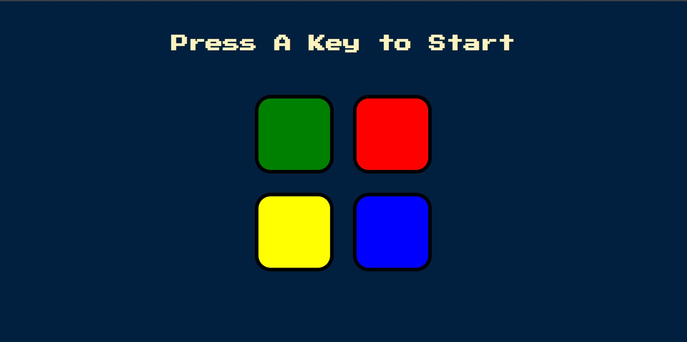

# Simon-game

🕹️ In the development of this game I learned about DOM manipulation with the jQuery library.

The Simon game is the exciting electronic game of lights and sounds in which players must repeat random sequences 
of lights by pressing the colored pads in the correct order. It's fast-paced play, with lights and sounds that can challenge you.

